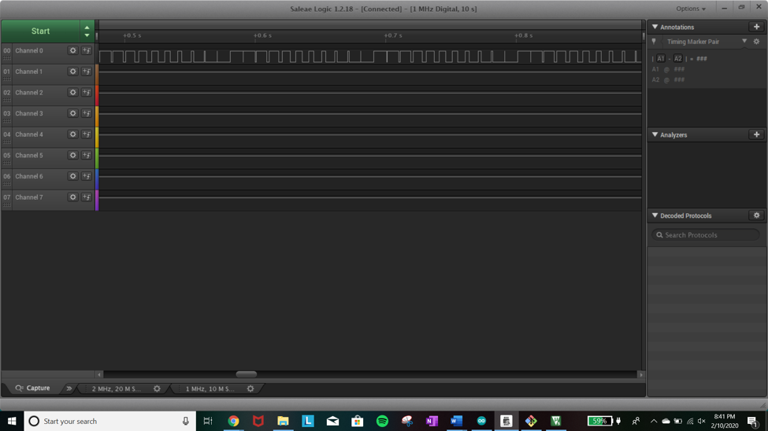

Name: Claire Romero

EID: cmr4789

Team Number:

## Questions

1. Why does your program need a setup and a loop?

    Programs need a setup to initialize ports and variables, and a loop is used to execute the functions required. 

2. What is the downside to putting all your code in a loop?

    You have to ensure that your loop is infinite when necessary, and ends at the correct condition when it is not an infinite loop. 

3. Why does your code need to be compiled?

    The compiler works as a type of translator, to change the code in C to machine code, so the computer can understand the programmer. 

4. When lowering the frequency in procedure A, step 4, what is going wrong? Brainstorm some solutions. Dimmers exist in the real world. What is their solution?

    your answer here

5. Why do you need to connect the logic analyzer ground to the ESP32 ground?

    Since ground is a reference point, the logic analyer will output accurate data about the ESP32 if it is using the same ground/reference point. 

6. What is the difference between synchronous and asynchronous communication?

    Synchronous communication is synchronized by a clock, while asynchronous communication is synchronized using specialized transmissions (different from normal signals). 

7. Profile of UART: Sent X bytes in Y time 

    7 bytes in 7.219 ms

8. Profile of SPI: Sent X bytes in Y time

    7 bytes in 0.1785 ms

9. Why is SPI so much faster than UART?

    UART is asynchronous, which means it uses only one signal. SPI is synchronous, and runs with a clock, and each direction of communication has its own line, which makes it faster.

10. list one pro and one con of UART

    Pro: Fewer wires required to be used 
    Con: Communication is not at fast 

11. list one pro and one con of SPI

    Pro: Faster communication
    Con: Requires more wires and can only be used for short distances

12. list one pro and one con of I2C

    Pro: Allows several "slave" digital ICs to be controlled 
    Con: Only intended for short distance communication, and requires far momre pins 

13. Why does I2C need external resistors to work?

    The external resistors are restore the signal to high whenever there is not device 
    asserting low on the other end to change the signal. 

## Screenshots

Procedure A, step 1:

Procedure A, step 4:

Procedure B, UART:

Procedure B, SPI:

